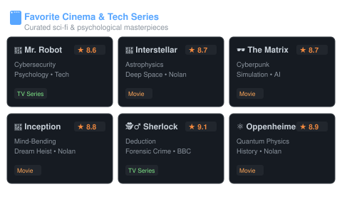

### 💡 Want to know what I'm currently working on?

Hi there! I am dedicated to crafting reliable multi-platform software, modern UI dashboards, and robust automated QA test suites.
Currently, I focus on delivering end-to-end regression testing suites, managing multi-tenant deployment architectures with **GitLab CI/CD & Cloudflare**, building modern web applications deployed on **Vercel**, and expanding automated testing with **Playwright & Jest** alongside continuous security & performance benchmarking.
Explore my live projects & status at **[paisali.my.id](https://paisali.my.id)**. Thanks for stopping by !

---

<table width="100%" border="0">
  <tr>
    <th width="50%" align="center">📊 GitHub Metrics &amp; Activity</th>
    <th width="50%" align="center">🎬 Cinema, Vibes &amp; Toolkit</th>
  </tr>
  <tr valign="top">
    <td width="50%" align="center">
      
    </td>
    <td width="50%" align="center">
      
    </td>
  </tr>
</table>

---
